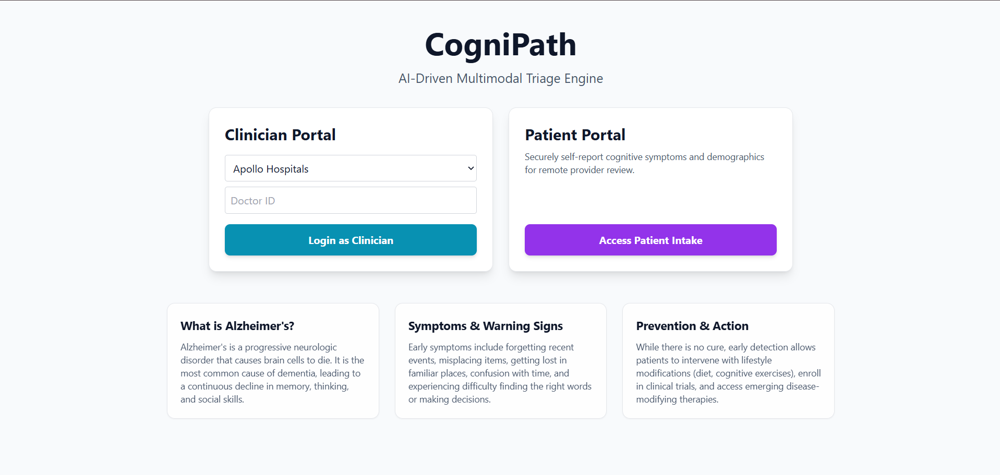
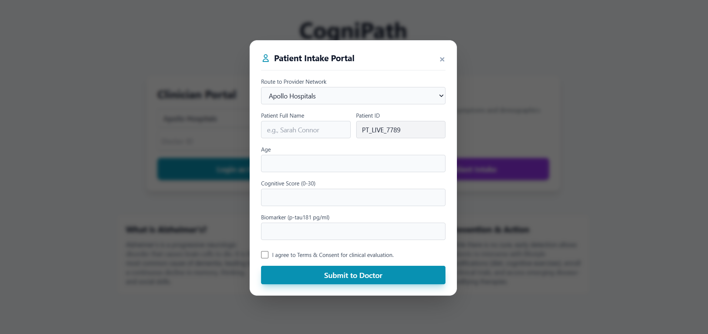
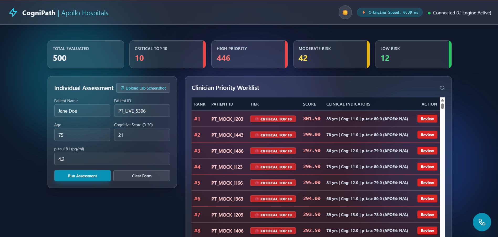

# CogniPath-BuildSprint26

# CogniPath 🧠

**[🎥 Watch the 2-Minute Demo Video](https://drive.google.com/file/d/1FEihsLXOR0s_0tLWiyZHLGLgJ-80eOqT/view?usp=sharing)** | **[🌍 Live Deployed Frontend](https://sohaam007.github.io/CogniPath-BuildSprint26/frontend/index.html)** | **[💻 GitHub Repository](https://github.com/Sohaam007/CogniPath-BuildSprint26)**

> **AI-Driven Multimodal Triage Engine for Cognitive Health & Neurodegenerative Risk Stratification**

CogniPath bridges the critical gap between patient self-reporting and clinical decision-making. By analyzing multimodal inputs—including cognitive screening scores and blood biomarkers—CogniPath accelerates early intervention and prioritization for patients at risk of cognitive decline.

---

## 📖 The Problem: Delayed Cognitive Intervention

Imagine Eleanor, a 68-year-old retired teacher experiencing subtle memory lapses. She misplaces her keys daily, struggles to follow complex conversations, and feels increasingly disoriented during routine errands. Her family requests a specialist evaluation.

When her primary care physician submits a referral to a regional neurology clinic, Eleanor enters a fragmented triage pipeline:

1. **The Waitlist Bottleneck**
Specialist clinics face overwhelming referral volumes, creating significant delays before patients receive an initial cognitive consultation.

2. **Subjective & Fragmented Data**
Traditional referrals may rely heavily on patient history and isolated cognitive scores while objective biological indicators remain disconnected from the initial prioritization process.

3. **Delayed Diagnostic Windows**
Earlier identification and prioritization can help clinicians focus attention on patients who may require more urgent evaluation.

---

## 💡 The CogniPath Solution

CogniPath introduces an AI-powered multimodal triage layer between patient intake and specialist evaluation.

The platform combines:
- 🧠 Cognitive screening scores
- 🧬 Blood-based biomarkers such as p-tau181
- 👤 Patient demographic information
- 📊 AI-driven risk scoring
- ⚡ High-performance patient ranking

CogniPath categorizes incoming cases into:

**🔴 HIGH → 🟠 MODERATE → 🟢 LOW**

This allows clinicians to quickly identify higher-priority cases instead of manually reviewing every referral with equal urgency.

> *CogniPath is a triage and prioritization system—not a diagnostic system. Final clinical decisions remain with qualified healthcare professionals.*

---

## 🚀 Key Features

### 🧑‍⚕️ Patient Intake Portal
A simple interface for patients or caregivers to submit relevant intake information, including:
- Age
- Cognitive screening score (0–30)
- Blood biomarker information
- Patient/caregiver information
- Clinical assessment inputs

### 🆔 Dynamic Patient Tracking
CogniPath generates unique patient identifiers such as:
`PT_LIVE_9021`
This allows cases to be tracked through the triage workflow without displaying unnecessary personal identifiers in the clinician queue.

### 🧬 Biomarker Integration Pipeline
CogniPath supports multimodal clinical inputs by combining cognitive information with objective biomarker data such as p-tau181 and Amyloid-Beta related biomarkers. The architecture is designed so that additional biomarkers can be integrated into the scoring pipeline.

### 🧠 AI Risk Stratification
The backend applies the project's risk-scoring configuration to incoming patient data and categorizes cases into:

| Risk Tier | Priority |
| :--- | :--- |
| **🔴 HIGH** | Immediate clinical review priority |
| **🟠 MODERATE** | Earlier specialist review |
| **🟢 LOW** | Routine review / monitoring |

The system is designed for prioritization, not autonomous diagnosis.

### 👨‍⚕️ Clinician Triage Dashboard
The clinician portal provides a centralized view of incoming cases, including:
- Patient priority queue
- Risk tier & Risk score
- Cognitive score & Biomarker values
- Cohort statistics
- Explainability indicators
- Prioritized patient ranking

### ⚡ Hybrid C/Python Triage Engine
CogniPath uses a hybrid architecture combining Python and native C. The high-performance ranking component (`ranker.c`) is compiled as a native library and accessed from Python using `ctypes`. The architecture also contains a Python sorting fallback to maintain system stability if the native C engine is unavailable.

```text
Python FastAPI
      ↓
   ctypes
      ↓
Native C Ranking Engine
      ↓
Prioritized Patient Queue

📈 Synthetic Cohort Benchmarking
CogniPath includes a synthetic patient cohort for performance testing. The benchmarking pipeline uses time.perf_counter() to measure ranking and triage execution latency across large synthetic cohorts. The project includes a 500+ patient synthetic dataset for testing and demonstration.
> Benchmark results depend on the execution environment and should not be interpreted as production clinical performance guarantees.
> 
🖥️ Seamless SPA Architecture
The frontend uses a single-page application architecture built with: HTML5, Vanilla JavaScript, Tailwind CSS, Client-side state management, and a Liquid Glass UI. Patient intake, clinician authentication screens, dashboards, and modals transition without unnecessary page reloads.
📐 System Architecture
CogniPath follows a decoupled client-server architecture combining a lightweight web frontend, FastAPI orchestration layer, AI scoring logic, and native C ranking engine.
┌─────────────────────────────────────────────────────────────────────┐
│                     LIQUID GLASS FRONTEND                           │
│                                                                     │
│  HTML5 + Tailwind CSS + Vanilla JavaScript (ES6+)                   │
│                                                                     │
│  • Landing Page                                                     │
│  • Patient Intake Portal                                            │
│  • Dynamic PT_LIVE_XXXX Tracking                                    │
│  • Clinician Portal                                                 │
│  • Risk Stratification Dashboard                                    │
│  • Cohort Statistics                                                │
└──────────────────────────────┬──────────────────────────────────────┘
                               │
                               │ REST API / JSON
                               ▼
┌─────────────────────────────────────────────────────────────────────┐
│                       FASTAPI BACKEND                               │
│                                                                     │
│  • FastAPI                                                          │
│  • Uvicorn                                                          │
│  • Pydantic Validation                                              │
│  • CORS Middleware                                                  │
│  • AI Risk Scoring                                                  │
│  • Python ctypes Bridge                                             │
└──────────────────────────────┬──────────────────────────────────────┘
                               │
                               │ ctypes
                               ▼
┌─────────────────────────────────────────────────────────────────────┐
│                    NATIVE C RANKING CORE                            │
│                                                                     │
│  ranker.c                                                           │
│                                                                     │
│  • High-performance patient ranking                                 │
│  • Native execution                                                 │
│  • ML scoring integration                                           │
│  • Python fallback                                                  │
└──────────────────────────────┬──────────────────────────────────────┘
                               │
                               ▼
┌─────────────────────────────────────────────────────────────────────┐
│                     PRIORITIZED TRIAGE QUEUE                        │
│                                                                     │
│       HIGH  →  MODERATE  →  LOW                                     │
└─────────────────────────────────────────────────────────────────────┘

🛠️ Tech Stack
Frontend
 * HTML5, CSS3, Tailwind CSS, Vanilla JavaScript (ES6+)
 * Liquid Glass UI & Client-side state management
Backend
 * Python 3.11+, FastAPI, Uvicorn, Pydantic, Python ctypes
AI / Risk Scoring
 * Multimodal clinical feature processing
 * Configurable ML scoring weights & Risk tier classification
High-Performance Computing
 * C (Native ranking engine ranker.c)
 * Python ctypes integration & Python sorting fallback
Data & Benchmarking
 * Synthetic patient cohort (JSON-based data pipeline)
 * Python unittest & time.perf_counter() latency profiling
🔌 API Credentials & Security
CogniPath is designed to avoid exposing sensitive credentials in the public repository.
🔐 No Hardcoded Secrets: API configuration, backend routes, and environment-specific variables should be supplied through configuration or environment variables rather than hardcoded secrets.
🛡️ Deterministic Fallback: When the backend is unavailable or disconnected, the frontend can fall back to deterministic demonstration data. This ensures that the core user journey remains demonstrable during hackathon judging.
> The fallback is intended for demonstration resilience and does not represent a production clinical data source.
> 
📁 Project Structure
CogniPath-BuildSprint26/
│
├── api/
│   └── main.py
│
├── frontend/
│   └── index.html
│
├── models/
│   └── scoring_config.json
│
├── ranker/
│   ├── ranker.c
│   └── ...
│
├── data/
│   └── mock_cohort.json
│
├── tests/
│   └── ...
│
├── generate_synthetic.py
├── requirements.txt
└── README.md

> File locations may vary slightly depending on the current repository build.
> 
🚀 Getting Started
1. Clone the Repository
git clone [https://github.com/Sohaam007/CogniPath-BuildSprint26.git](https://github.com/Sohaam007/CogniPath-BuildSprint26.git)
cd CogniPath-BuildSprint26

2. Testing the Frontend
The frontend can be accessed directly through the deployed GitHub Pages application:
🌍 Live Frontend: https://sohaam007.github.io/CogniPath-BuildSprint26/frontend/index.html
You can also run the frontend locally:
Option 1 — Open Directly: Open frontend/index.html in a modern web browser.
Option 2 — Run Through a Local Server:
python -m http.server 5500

Then open: http://localhost:5500/frontend/
3. Running the AI Triage Backend
Ensure that Python 3.11+ is installed.
# Install Dependencies
pip install -r requirements.txt

# Start FastAPI
uvicorn api.main:app --reload

The backend will normally run at: http://localhost:8000
Interactive API Documentation: Open http://localhost:8000/docs to use FastAPI's Swagger interface to inspect and test the available endpoints.
🔬 C Ranking Engine
The project includes a native C ranking engine used through Python ctypes. If the native engine cannot be loaded, the backend can use the Python sorting implementation as a fallback. This hybrid design demonstrates how Python can be combined with lower-level native code for performance-sensitive components.
🧪 Synthetic Cohort Benchmark
CogniPath includes a synthetic cohort generation and benchmarking pipeline.
python generate_synthetic.py

Latency measurements are performed using time.perf_counter(). This allows high-resolution performance profiling during development and demonstrations for risk scoring, patient ranking, and C engine vs Python fallback performance.

🌌 Interactive Walkthrough for Judges
Follow this sequence to experience the complete CogniPath workflow.
 * Step 1 — Open the Live Portal: 🌍 Live Deployed Frontend
 * Step 2 — Start Patient Intake: Click Access Patient Intake, then select Generate ID. A unique demonstration identifier will be generated (e.g., PT_LIVE_9021).
 * Step 3 — Submit Clinical Information: Enter example demonstration data (Age: 68, Cognitive Score: 18 / 30, p-tau181: 2.4 pg/mL), then click Submit Assessment.
 * Step 4 — Open the Clinician Portal: Return to the main portal. Select a medical center, enter the demonstration clinician ID (DOC_77), and select Login as Clinician.
 * Step 5 — Inspect the Triage Dashboard: The dashboard displays the patient priority queue, risk stratification, cognitive scores, and biomarker vectors. The highest-priority cases are surfaced first.

🧠 Clinical Safety & Scope
CogniPath is designed as a clinical triage and prioritization prototype.
It does not:
 * Diagnose Alzheimer's disease
 * Replace a neurologist or physician
 * Provide definitive treatment recommendations
 * Replace validated clinical assessments
 * Guarantee individual patient outcomes
The AI output is intended to help healthcare professionals prioritize cases for further evaluation. All clinical decisions should remain under the supervision of qualified healthcare professionals.

```

🖼️ Interface Showcase

### Landing Page & Patient Intake




### Clinician Triage Dashboard



🎥 Demo & Links
▶️ Watch the 2-Minute Product Demonstration
The demo showcases the complete workflow:
Patient Intake
      ↓
Dynamic Patient ID
      ↓
Clinical + Biomarker Data
      ↓
AI Risk Scoring
      ↓
C / Python Ranking Engine
      ↓
Prioritized Clinician Queue

🌍 Live Application: 🚀 Open the Live Frontend
💻 Source Code: View the GitHub Repository
🏆 Built for BuildSprint 2026
CogniPath was built by Team Code Blue for BuildSprint 2026.
Our goal is simple:
> Turn fragmented cognitive-health referrals into an intelligent, multimodal priority queue—so clinicians can focus attention where it matters most.
> 
Team Code Blue
Built with: Python + FastAPI + AI/ML + C + ctypes + JavaScript
Built by Team Code Blue for fast, reliable healthcare triage during BuildSprint 2026.

